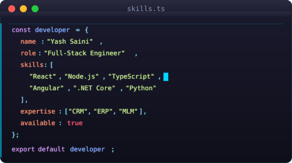
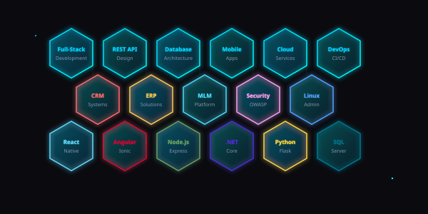
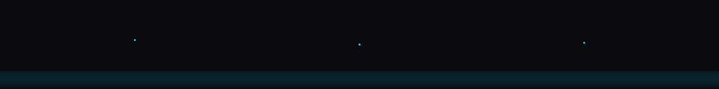

<table width="100%">
<tr>
<td>

<div align="center">

# 👋 Hi, I'm Yash Saini

### 💻 Full-Stack Developer | Software Engineer | Mobile App Developer

 **Open to Remote Opportunities**

[](mailto:yashsaini1065@gmail.com)
[](https://linkedin.com/in/yashsaini1065)
[](https://github.com/yashsaini1065)


</div>

<picture>
  <source media="(prefers-color-scheme: dark)" srcset="./assets/anim/divider_dark.svg">
  <source media="(prefers-color-scheme: light)" srcset="./assets/anim/divider_light.svg">
  
</picture>

## 🚀 About Me

```typescript
const yashSaini = {
    location: "Delhi, India 🇮🇳",
    role: "Full-Stack Software Engineer",
    experience: "2.7+ Years Total Experience",
    workExperience: "1.7+ Years at Vista Neotech",
    selfLearning: "1 Year intensive training",
    currentFocus: ["MLM Systems", "ERP Solutions", "Mobile Apps", "Cybersecurity"],
    openToWork: true,
    workMode: ["Remote", "Hybrid", "On-site"],
    
    code: ["JavaScript", "TypeScript", "Python", "C#", "SQL", "Bash"],
    
    expertise: [
        "CRM/ERP Development", "MLM Systems", "Mobile Apps",
        "Cybersecurity", "Linux Administration", "API Design"
    ],
    
    askMeAbout: [
        "Web Development", "Mobile Apps", "CRM/ERP Systems",
        "MLM Platforms", "Linux", "Cybersecurity", "Database Architecture"
    ],
    
    currentlyLearning: ["AWS", "Docker", "Kubernetes", "Advanced Cybersecurity"],
    
    funFact: "I turn coffee ☕ into secure, scalable enterprise solutions! 💻🔐"
};
```

<picture>
  <source media="(prefers-color-scheme: dark)" srcset="./assets/anim/divider_dark.svg">
  <source media="(prefers-color-scheme: light)" srcset="./assets/anim/divider_light.svg">
  
</picture>

## 💻 Technical Expertise

<div align="center">
  
</div>

<div align="center">
  
</div>

<br/>

<div align="center">
  
</div>

<picture>
  <source media="(prefers-color-scheme: dark)" srcset="./assets/anim/divider_dark.svg">
  <source media="(prefers-color-scheme: light)" srcset="./assets/anim/divider_light.svg">
  
</picture>

## 🎯 Domain Expertise

<div align="center">
  
</div>

<picture>
  <source media="(prefers-color-scheme: dark)" srcset="./assets/anim/divider_dark.svg">
  <source media="(prefers-color-scheme: light)" srcset="./assets/anim/divider_light.svg">
  
</picture>

## 💼 Professional Experience

### 🏢 **Software Engineer** | Vista Neotech
**📅 June 11, 2024 - Present** *(1 Year 8 Months)*

- 🏢 **CRM Development:** Built comprehensive Customer Relationship Management systems with sales pipeline automation, lead tracking, and customer analytics
- 📊 **ERP Solutions:** Developed Enterprise Resource Planning modules for inventory management, HR, accounting, and business process automation
- 🔗 **MLM Platform:** Architected Multi-Level Marketing system with binary tree structure, commission calculation, genealogy tracking, and payout management
- 📱 **Mobile Applications:** Created cross-platform mobile apps using React Native and Ionic for iOS and Android
- 🎯 Designed **hotel booking platforms** serving 1000+ concurrent users with real-time availability
- 🚀 Built **Web-to-APK Converter** reducing build time by **60%**
- 💼 Implemented **role-based access control** and **secure authentication** systems
- ⚡ Optimized application performance by **40%** through code splitting & lazy loading
- 🔐 Applied **cybersecurity best practices** including data encryption, SQL injection prevention, and secure API design
- 🐧 Managed **Linux servers** for application deployment and maintenance

### 🎓 **Self-Learning & Skill Development**
**📅 June 2023 - June 2024** *(1 Year)*

- 📚 Completed intensive training in **React, Angular, Node.js, Python, .NET Core**
- 🛠️ Built **15+ full-stack projects** including e-commerce, booking systems, and dashboards
- 🧩 Mastered **Data Structures & Algorithms** through 500+ problem-solving exercises
- 🐧 Learned **Linux system administration**, shell scripting, and server management
- 🔒 Studied **cybersecurity fundamentals**: network security, penetration testing, OWASP Top 10
- 🏆 Completed certifications in React, Node.js, Firebase, and Cloud technologies
- 💡 Developed understanding of software design patterns and clean architecture principles

<picture>
  <source media="(prefers-color-scheme: dark)" srcset="./assets/anim/divider_dark.svg">
  <source media="(prefers-color-scheme: light)" srcset="./assets/anim/divider_light.svg">
  
</picture>

## 🛠️ Tech Stack

### **Frontend Development**


### **Backend Development**


### **Databases**


### **Mobile Development**


### **Tools & Technologies**


### **Operating Systems & DevOps**


### **Security & Networking**


<picture>
  <source media="(prefers-color-scheme: dark)" srcset="./assets/anim/divider_dark.svg">
  <source media="(prefers-color-scheme: light)" srcset="./assets/anim/divider_light.svg">
  
</picture>

## 🏆 Featured Projects

<div align="center">
  
  <h2>📌 Pinned Projects</h2>
  
</div>

### 🔗 **MLM (Multi-Level Marketing) Platform**
**Tech Stack:** React · Node.js · Express.js · MongoDB · JWT · Payment Gateway

🎯 Complete MLM system with binary tree structure and commission automation  
✨ Features: Genealogy tree, rank advancement, commission calculation, e-wallet, KYC verification  
📊 **Impact:** Manages 5000+ members, processes automated payouts, real-time dashboard

[](https://github.com/yashsaini1065)

---

### 💼 **Enterprise CRM System**
**Tech Stack:** Angular · .NET Core · MS SQL Server · Azure · SignalR

🎯 Full-featured CRM with sales pipeline, lead management, and analytics  
✨ Features: Contact management, opportunity tracking, email integration, reporting, forecasting  
📊 **Impact:** 100+ users, 30% increase in sales conversion, automated follow-ups

[](https://github.com/yashsaini1065)

---

### 📊 **ERP (Enterprise Resource Planning) Solution**
**Tech Stack:** React · Node.js · PostgreSQL · Redis · Docker

🎯 Modular ERP system covering inventory, HR, accounting, and procurement  
✨ Features: Inventory tracking, payroll management, invoice generation, purchase orders  
📊 **Impact:** 50+ businesses using, reduced operational costs by 25%

[](https://github.com/yashsaini1065)

---

### 🏨 **Hotel Booking Platform**
**Tech Stack:** Angular · TypeScript · Firebase · Bootstrap · REST API

🎯 Responsive booking application with advanced search, real-time availability, and payment integration  
✨ Features: Dynamic filters, date validation, room selection, secure checkout, admin dashboard  
📊 **Impact:** Handles 1000+ concurrent users with optimized performance

[](https://github.com/yashsaini1065)

<picture>
  <source media="(prefers-color-scheme: dark)" srcset="./assets/anim/divider_dark.svg">
  <source media="(prefers-color-scheme: light)" srcset="./assets/anim/divider_light.svg">
  
</picture>


## 🎯 Core Competencies

<div align="center">

| 💻 **Development** | 🏢 **Enterprise** | 🔒 **Security** | 🚀 **DevOps** |
|:---:|:---:|:---:|:---:|
| Full-Stack Development | CRM Systems | Cybersecurity | Linux Server Management |
| REST API Design | ERP Solutions | Data Encryption | CI/CD Pipelines |
| Database Architecture | MLM Platforms | OWASP Top 10 | Docker & Kubernetes |
| Mobile Apps | Business Automation | Network Security | Shell Scripting |

</div>

<picture>
  <source media="(prefers-color-scheme: dark)" srcset="./assets/anim/divider_dark.svg">
  <source media="(prefers-color-scheme: light)" srcset="./assets/anim/divider_light.svg">
  
</picture>

## 📈 What I'm Currently Working On

- 🔭 Building **MLM platforms** with advanced genealogy and commission systems
- 🏢 Developing **enterprise ERP modules** for business automation
- 📱 Creating **cross-platform mobile apps** with React Native and Ionic
- 🔐 Implementing **cybersecurity measures** and secure coding practices
- 🐧 Managing **Linux servers** and deployment pipelines
- 🌱 Learning **AWS Cloud Services** and **Kubernetes orchestration**
- 👯 Contributing to **open-source projects** in React & Angular ecosystems
- 💬 Exploring **penetration testing** and **network security** concepts

<div align="center">
  <br/>
  
</div>

<picture>
  <source media="(prefers-color-scheme: dark)" srcset="./assets/anim/divider_dark.svg">
  <source media="(prefers-color-scheme: light)" srcset="./assets/anim/divider_light.svg">
  
</picture>

## 💡 Development Philosophy

> **"Clean code, scalable architecture, and exceptional user experience"**

```python
# My Development Principles
principles = {
    "code_quality": "Write maintainable, testable, and documented code",
    "performance": "Optimize for speed without sacrificing readability",
    "user_first": "Build intuitive interfaces with accessibility in mind",
    "continuous_learning": "Stay updated with latest technologies and best practices",
    "collaboration": "Communicate effectively and embrace code reviews",
    "problem_solving": "Break complex problems into manageable solutions"
}
```

<picture>
  <source media="(prefers-color-scheme: dark)" srcset="./assets/anim/divider_dark.svg">
  <source media="(prefers-color-scheme: light)" srcset="./assets/anim/divider_light.svg">
  
</picture>

## 🤝 Let's Connect & Collaborate!

<div align="center">

I'm always excited to work on innovative projects and collaborate with talented developers!

**Open to:**
- 💼 Full-time opportunities (Remote/Hybrid/On-site)
- 🚀 Freelance projects
- 🤝 Open-source contributions
- 💡 Technical consulting
- 🎓 Mentoring & knowledge sharing

### 📫 Reach Out:

[](mailto:yashsaini1065@gmail.com)
[](tel:+918700966561)
[](https://github.com/yashsaini1065)
[](https://linkedin.com/in/yashsaini1065)

<br/>

<a href="mailto:yashsaini1065@gmail.com">
  
</a>

</div>

<picture>
  <source media="(prefers-color-scheme: dark)" srcset="./assets/anim/divider_dark.svg">
  <source media="(prefers-color-scheme: light)" srcset="./assets/anim/divider_light.svg">
  
</picture>

## 🎨 Profile Visitors & Contributions

<div align="center">


### 📅 Contribution Graph


</div>

<picture>
  <source media="(prefers-color-scheme: dark)" srcset="./assets/anim/divider_dark.svg">
  <source media="(prefers-color-scheme: light)" srcset="./assets/anim/divider_light.svg">
  
</picture>

## ⚡ Quick Facts

- 🌍 **Location:** Delhi, India
- 💼 **Total Experience:** 2.7+ Years (1.7+ Years Professional + 1 Year Self-Learning)
- 🏢 **Company:** Vista Neotech (June 11, 2024 - Present)
- 🎯 **Current Projects:** MLM Systems, ERP Solutions, Mobile Apps
- 📧 **Email:** yashsaini1065@gmail.com
- 📱 **Phone:** +91-8700966561
- 🗣️ **Languages:** English (Professional), Hindi (Native)
- ⏰ **Availability:** Immediate (30 days notice period)
- 🌐 **Work Preference:** Remote, Hybrid, or On-site
- 🚀 **Specialization:** Full-Stack Web & Mobile, CRM/ERP, MLM, Linux & Cybersecurity
- 🎓 **Focus Areas:** React, Angular, Node.js, .NET Core, Mobile Apps, Enterprise Solutions

<div align="center">

### 🌟 "Building digital solutions that make a difference" 🌟

---

**💻 Made with ❤️ by Yash Saini**

*Last Updated: February 2026*

</div>



</td>
</tr>
</table>


